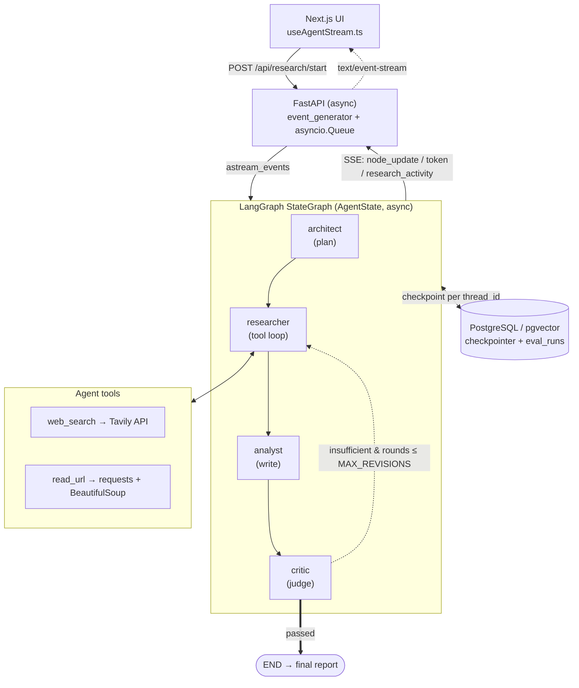

# Cognito — System Design

> A multi-agent, web-grounded research assistant. A user asks a question; a team of
> LLM agents plans the work, searches and reads the web, drafts a report, critiques
> it, and (if needed) loops back for another research pass — streaming every step to
> the browser in real time.

This document describes the **abstract architecture**, the **scaling trade-offs** at
different operating points, and a set of **senior-engineer interview questions** the
design invites. It is written against the code as it exists in this repository, not an
idealized version of it.

---

## 1. Abstract Architecture

### 1.1 The big picture

```
┌──────────────┐     POST /api/research/start      ┌────────────────────────────┐
│  Next.js UI  │ ────────────────────────────────► │        FastAPI (async)      │
│ (App Router) │ ◄──────── SSE: text/event-stream ─│  event_generator + queue    │
└──────────────┘                                    └──────────────┬─────────────┘
      ▲  useAgentStream.ts                                          │ astream_events
      │  (parses node_update / token /                              ▼
      │   research_activity / revision)              ┌────────────────────────────┐
      │                                              │     LangGraph StateGraph     │
      │                                              │      (AgentState, async)     │
      │                                              └──────────────┬──────────────┘
      │                                                             │
      │      ┌───────────┐   ┌────────────┐   ┌──────────┐   ┌──────────┐
      │      │ architect │──►│ researcher │──►│ analyst  │──►│  critic  │
      │      │  (plan)   │   │ (tool loop)│   │ (write)  │   │ (judge)  │
      │      └───────────┘   └─────┬──────┘   └──────────┘   └────┬─────┘
      │                            │  tools                       │
      │                            ▼                  conditional edge:
      │                    ┌───────────────┐          pass → END
      │                    │  web_search   │─Tavily   fail → researcher (≤ MAX_REVISIONS)
      │                    │  read_url     │─requests+BeautifulSoup
      │                    └───────────────┘
      │
      └───────────────────── progress queue (per thread_id) ──────────────────┘

                         ┌──────────────────────────────┐
                         │  PostgreSQL (pgvector image)  │
                         │  • LangGraph checkpointer      │  (graph state per thread)
                         │  • eval_runs table             │  (LLM-as-judge scores)
                         └──────────────────────────────┘
```

The same picture rendered (GitHub/Mermaid-aware viewers):



### 1.2 Control flow

The system is a **directed graph with one reflection cycle**, defined in
`backend/graph/workflow.py`:

```
architect → researcher → analyst → critic ─┬─(passed)──────────────► END
                ▲                           │
                └──(insufficient & budget)──┘
```

- **`architect`** (`agents/manager.py`) — decomposes the user request into 3–5 search
  tasks. Uses `with_structured_output(ResearchPlan)` so the plan comes back as a typed
  Pydantic object, not free text.
- **`researcher`** (`agents/researcher.py`) — an **autonomous tool-calling loop**. The
  LLM is bound to two tools (`web_search`, `read_url`) and decides which to call and
  when, for up to `MAX_RESEARCH_TURNS = 3` turns. On a revision pass it researches
  *only* the gaps the critic flagged, and **accumulates** findings across rounds rather
  than replacing them.
- **`analyst`** (`agents/analyst.py`) — synthesizes the accumulated raw data into a
  structured Markdown report. Explicitly instructed to use *only* supplied data (a
  hallucination guard). On revisions it folds the critique into the prompt.
- **`critic`** (`agents/critic.py`) — an LLM-as-judge that returns a structured verdict
  (`sufficient`, `feedback`, `missing[]`). Its output drives the conditional edge.

The loop is **bounded**: `route_after_critic` ends the run if the critic passes *or* if
`research_rounds > MAX_REVISIONS` (= 1). This is a deliberate cost/latency guardrail —
a stubborn critic can never bill forever.

### 1.3 Shared state

All nodes read and write a single `AgentState` `TypedDict` (`backend/graph/state.py`).
Key fields: `user_request`, `plan`, `gathered_data` (accumulated), `final_report`,
`research_rounds`, `critique`, `critique_passed`, `missing_info`, and `thread_id`.
`messages` uses LangGraph's `add_messages` reducer for append semantics; the rest are
last-write-wins.

### 1.4 Streaming model

There are two layers of streaming, bridged by an `asyncio.Queue`:

1. **LangGraph → backend.** `event_generator` in `main.py` consumes
   `cognito_graph.astream_events(...)`. It tracks the current node and emits:
   - `node_update` when any node finishes (carries the plan / report / critique),
   - `token` events **only while the analyst is writing** (so the user sees the report
     typed out, but not the noisy tool/structured-output chatter of other nodes),
   - `report_reset` when a fresh analyst pass starts (so a revision visibly rewrites).
2. **Researcher → backend (out of band).** The researcher node can't return tool
   activity through the normal node output because it happens *mid-node*. So there's a
   **module-level registry** `_progress_queues: dict[thread_id → asyncio.Queue]`.
   `main.py` registers a queue before the run; the researcher pushes
   `research_activity` / `revision` events into it directly. Both sources funnel into
   the same SSE stream.
3. **Backend → UI.** Server-Sent Events (`text/event-stream`). `useAgentStream.ts`
   reads the response body, buffers partial lines across network chunks, and maps each
   event type onto React state (stage, plan, report, activities, critique, round).

### 1.5 Persistence

- **LangGraph checkpointer** — `AsyncPostgresSaver` over a shared `psycopg` async pool
  (`database/db.py`, `max_size=20`, `autocommit=True`). Every thread's graph state is
  checkpointed, keyed by `thread_id`. This is what makes runs resumable and durable
  across process restarts.
- **`eval_runs` table** — the LLM-as-judge harness writes per-question scores
  (accuracy / depth / hallucination / citations / composite) here; the `/api/evals`
  endpoint aggregates them for the evals dashboard (`frontend/app/evals/page.tsx`).

### 1.6 Complete tool & technology inventory

| Layer | Tool / Library | Role in the system |
|---|---|---|
| **Orchestration** | **LangGraph** (`StateGraph`, conditional edges, `astream_events`) | The agent state machine + reflection loop |
| | **LangChain Core** (`ChatPromptTemplate`, `@tool`, messages) | Prompting, tool binding, message plumbing |
| **LLM** | **OpenAI `gpt-4o-mini`** via `langchain-openai` | All four agents + the judge (varying temperature: 0 for plan/critic, 0.1 researcher, 0.4 analyst) |
| **Structured output** | **Pydantic v2** (`ResearchPlan`, `Critique`) | Typed, validated agent outputs via `with_structured_output` |
| **Agent tools** | **`web_search`** → **Tavily API** (`search_depth=advanced`, `time_range` recency filter) | Web discovery |
| | **`read_url`** → **`requests` + BeautifulSoup4** (strips script/nav/footer, caps text) | Deep content extraction |
| **API** | **FastAPI** (async) + **`StreamingResponse`** | HTTP surface, SSE streaming, lifespan-managed graph init |
| | **CORS middleware** | Allows the `localhost:3000` frontend |
| **Persistence** | **PostgreSQL** (`pgvector/pgvector:pg16` image) | Checkpointer store + eval results; pgvector present for future RAG |
| | **`psycopg` v3** + **`psycopg_pool.AsyncConnectionPool`** | Async DB access, connection pooling |
| | **`langgraph-checkpoint-postgres`** (`AsyncPostgresSaver`) | Durable graph state |
| **Concurrency** | **`asyncio`** (`Queue`, `create_task`, `to_thread`) | Bridges the synchronous Tavily/requests calls off the event loop; fan-in for streaming |
| **Frontend** | **Next.js 16** (App Router) + **React 18** + **Tailwind** + **lucide-react** | UI, live agent visualization |
| | **`useAgentStream` hook** + **Fetch streaming API** | SSE consumption and state mapping |
| **Quality / CI** | **pytest + pytest-asyncio**, **LLM-as-judge**, **GitHub Actions** | 20-question golden-dataset regression gate (fails build if composite < 3.5/5) |
| | **LangSmith tracing** (`LANGCHAIN_TRACING_V2`) | Observability in CI |
| **Config** | **python-dotenv** | Secrets (`OPENAI_API_KEY`, `TAVILY_API_KEY`, `POSTGRES_URI`) |
| **Infra (dev)** | **Docker Compose** | Local Postgres with a persistent volume |

> Note: README/code mention a few inconsistencies worth knowing — the README quotes a
> 4.0/5.0 gate while the test asserts `>= 3.5`; the README's diagram omits the critic.
> The code is the source of truth.

---

## 2. Scaling Trade-offs

This architecture is excellent for a **prototype / single-tenant / demo** and was
clearly designed as one. The interesting engineering question is what breaks, and in
what order, as load grows. I'll walk three operating points.

### 2.1 Operating point A — single user / demo (where it is today)

**What's right for this scale:**
- In-process `asyncio.Queue` per thread is the simplest possible streaming bridge — no
  broker, no extra infra.
- A single FastAPI process holds the compiled graph in a module global
  (`cognito_graph`) and a 20-connection pool — fine for a handful of concurrent runs.
- Bounded turns (`MAX_RESEARCH_TURNS=3`) and revisions (`MAX_REVISIONS=1`) keep any one
  request's cost and latency predictable.

**Cost/latency profile:** A single request is **sequential and LLM-bound**: architect
(1 call) → researcher (up to 3 turns + possible wrap) → analyst (1 streamed call) →
critic (1 call), optionally ×2 for a revision. That's roughly 5–10 LLM round-trips plus
several network-bound Tavily/scrape calls — call it tens of seconds, dominated by
external I/O.

### 2.2 Operating point B — hundreds of concurrent users

Here the **single-process, in-memory assumptions** start to bite:

| Bottleneck | Why it breaks | Mitigation |
|---|---|---|
| **`_progress_queues` is a process-local dict** | If you run >1 backend replica behind a load balancer, the SSE connection and the graph execution must land on the **same process**. A horizontally scaled deployment breaks streaming. | Move progress events to **Redis Pub/Sub** (or LangGraph's native streaming over a message bus) keyed by `thread_id`; any replica can then serve the stream. |
| **DB pool `max_size=20`** | Each in-flight run holds checkpointer connections; the checkpointer reads/writes state at every node boundary. 20 connections caps real concurrency well below "hundreds." | Raise pool size, but more importantly put **PgBouncer** in front of Postgres and size pools per replica. Watch for the `autocommit=True` requirement the checkpointer needs. |
| **Long-lived SSE connections** | Each research run pins an HTTP connection (and a worker coroutine) for its full multi-second lifetime. Hundreds of simultaneous runs = hundreds of open sockets per replica. | This is fine for async FastAPI up to a point; beyond it, scale replicas horizontally (which forces the Redis change above) and set sane connection/timeouts. |
| **No queue / backpressure** | Every request starts a graph immediately. A traffic spike translates directly into a spike of concurrent OpenAI/Tavily calls → rate-limit errors (429s) and cost spikes. | Introduce a **work queue** (Celery/Arq/SQS) with a concurrency cap and per-tenant rate limiting; the SSE endpoint then subscribes to results rather than driving execution inline. |
| **Synchronous tools on `to_thread`** | `perform_search`/`scrape_url` are blocking and offloaded to the default thread pool. Under high concurrency the thread pool becomes a hidden bottleneck. | Switch to async HTTP (`httpx`/`aiohttp`), or bound and tune the executor explicitly. |

**The architecture is still fundamentally sound here** — it just needs the
"in-memory glue" replaced with networked equivalents (Redis for streaming, a queue for
admission control, PgBouncer for the DB).

### 2.3 Operating point C — high throughput / many tenants / cost-sensitive

At this scale the questions become economic and operational, not just structural:

- **Cost.** Every run is 5–10+ LLM calls and N web fetches. The biggest lever is
  **caching**: cache Tavily results and scraped pages (content-addressed by
  URL/query), and cache architect plans for near-duplicate questions. Add a
  **semantic cache** for whole answers — the pgvector image is already present and
  unused, which is the intended hook for this.
- **Model tiering.** Everything currently uses `gpt-4o-mini`. At scale you'd route by
  difficulty: a cheap model for planning/critique, a stronger model only for synthesis
  of hard questions. The judge especially should be a fixed, pinned model for eval
  stability.
- **The critic loop is unbounded cost variance.** `MAX_REVISIONS=1` caps it today, but
  if you raise it for quality you reintroduce tail-latency and cost blow-ups. Consider
  **early-exit heuristics** (skip the critic for "easy" questions) and **budget-aware
  routing**.
- **Reliability.** Single OpenAI/Tavily dependency = single point of failure. Add
  retries with jitter, circuit breakers, provider fallback, and graceful degradation
  (ship the best draft if the critic times out — the graph already does this on budget
  exhaustion).
- **Multi-tenancy.** `thread_id` is a random UUID with no tenant/user scoping or
  authn/z. At multi-tenant scale you need tenant isolation in the checkpointer keyspace,
  per-tenant rate limits and quotas, and row-level access control on `eval_runs`.
- **Statefulness vs. serverless.** The long-lived SSE + in-process graph model resists
  serverless/autoscale-to-zero. A queue-plus-pubsub redesign decouples *execution* from
  *delivery* and lets you scale the two independently.

### 2.4 Summary trade-off table

| Concern | Demo (now) | Mid-scale | High-scale |
|---|---|---|---|
| Streaming bridge | in-proc `asyncio.Queue` | Redis Pub/Sub | Redis/broker + decoupled delivery |
| Execution model | inline in request | inline + replicas | work queue + workers |
| DB access | 20-conn pool | pool + PgBouncer | PgBouncer + read replicas |
| Cost control | bounded turns/revisions | + rate limiting | + caching + model tiering |
| Reliability | best-effort | retries | circuit breakers + fallbacks |
| Tenancy | none | basic auth | full isolation + quotas |

---

## 3. Interview Questions a Senior Engineer Would Ask

Grouped by theme. Good answers reference the actual mechanisms above.

### 3.1 Architecture & orchestration
1. **Why a graph (LangGraph) instead of a hardcoded function pipeline or a single
   ReAct agent?** What does the explicit state machine buy you (resumability,
   inspectable state, the conditional reflection edge) and what does it cost?
2. The researcher is an **autonomous tool loop** but the overall flow is a **fixed
   graph**. Why mix the two paradigms instead of making everything one big agent, or
   everything fully deterministic?
3. Walk me through the **reflection loop**. Why is `MAX_REVISIONS=1`? What happens to
   cost/quality if it were 3? How would you decide the right number empirically?
4. `gathered_data` **accumulates** across rounds while `final_report` is overwritten.
   Why the asymmetry, and what bug would appear if the researcher *replaced* data on a
   revision instead?

### 3.2 Concurrency & streaming
5. Explain the **two streaming paths** (node events via `astream_events` vs. researcher
   activity via the `_progress_queues` registry). Why couldn't the researcher's tool
   activity ride the normal node-output channel?
6. `_progress_queues` is a **module-level dict**. What exactly breaks the moment you run
   two backend replicas, and how would you fix it without rewriting the agents?
7. The tools are **synchronous** and run via `asyncio.to_thread`. What's the failure
   mode under high concurrency, and why does it not show up in testing?
8. The SSE generator creates a `graph_task` and drains a queue with a `None` sentinel.
   What happens to that task if the **client disconnects mid-stream**? How would you
   guarantee cleanup? (Hint: `finally: unregister_queue`, but is the task cancelled?)

### 3.3 State, persistence & correctness
9. Why does the checkpointer pool require `autocommit=True`? What would silently go
   wrong without it?
10. `thread_id` is a fresh UUID per request with no auth. Walk me through what a
    **multi-tenant** version needs in the checkpointer keyspace and the API layer.
11. The graph state is a `TypedDict` with mostly last-write-wins fields but `messages`
    uses the `add_messages` reducer. When does that distinction actually matter?

### 3.4 Reliability & cost
12. Map the **external failure modes** (OpenAI 429/5xx, Tavily down, a scrape timing
    out, the judge returning unparseable JSON). Which are handled today, which aren't,
    and which are silent? (e.g. `evaluate_quality` defaults to all-1s on parse failure —
    is failing closed the right call for an eval gate?)
13. Where would you add **caching** first for the biggest cost win, and how would you
    key it? What correctness risks does caching web results introduce for
    *time-sensitive* queries (note the `recency` filter exists for exactly this tension)?
14. Everything is `gpt-4o-mini`. Make the case for and against **model tiering** across
    the four agents. Which agent is most sensitive to model quality?

### 3.5 Evaluation & quality
15. The CI gate uses **LLM-as-judge** with a composite threshold. What are the failure
    modes of LLM-as-judge (self-preference, prompt sensitivity, non-determinism), and
    how do you keep the gate **stable enough to block merges** without flaking?
16. The judge is the same model family as the agents. Why is that a problem, and what
    would you change?
17. The threshold is hardcoded (`>= 3.5`) and the README says 4.0. How would you set
    and evolve a quality bar so it's neither a rubber stamp nor a flaky blocker?
18. The eval suite hits **real OpenAI + Tavily in CI** on every PR. What does that cost
    you in money, time, and flakiness, and how would you restructure it (recorded
    fixtures? a nightly full run + a fast PR subset?)?

### 3.6 Security & robustness
19. `read_url` fetches **arbitrary URLs the LLM chooses**. Walk through the **SSRF**
    risk (internal metadata endpoints, `localhost`, link-local) and how you'd sandbox
    it.
20. Scraped page content flows into later LLM prompts. How do you defend against
    **indirect prompt injection** from a malicious page telling the analyst what to
    write?
21. CORS is wired to `localhost:3000` and there's no authn, rate limiting, or input
    validation beyond a Pydantic `query: str`. What's the minimum you'd add before this
    faces the public internet?

### 3.7 The "make it better" finale
22. You have **one week** to make Cognito production-ready for 1,000 concurrent users.
    What are your first three changes and why? *(Strong answer: (1) move streaming to
    Redis Pub/Sub so you can run >1 replica, (2) add a work queue + rate limiting for
    admission control and 429 protection, (3) cache Tavily/scrape results — each unlocks
    the next bottleneck in order.)*
23. If you could only keep **three components** of this stack and replace the rest, what
    would you keep? Defend it.

---

## Appendix — Source map

| Concern | File |
|---|---|
| API, SSE bridge, eval aggregation | `backend/main.py` |
| Graph definition + reflection routing | `backend/graph/workflow.py` |
| Shared state schema | `backend/graph/state.py` |
| Architect (planning) | `backend/agents/manager.py` |
| Researcher (tool loop + progress queue) | `backend/agents/researcher.py` |
| Analyst (synthesis) | `backend/agents/analyst.py` |
| Critic (LLM-as-judge verdict) | `backend/agents/critic.py` |
| Tools (Tavily search + scrape) | `backend/tools/search_scraper.py` |
| DB pool | `backend/database/db.py` |
| Eval harness + golden dataset | `backend/tests/test_ai_quality.py` |
| CI regression gate | `.github/workflows/ai-regression-gate.yml` |
| Frontend stream consumption | `frontend/hooks/useAgentStream.ts` |
| Local infra | `docker-compose.yml` |
